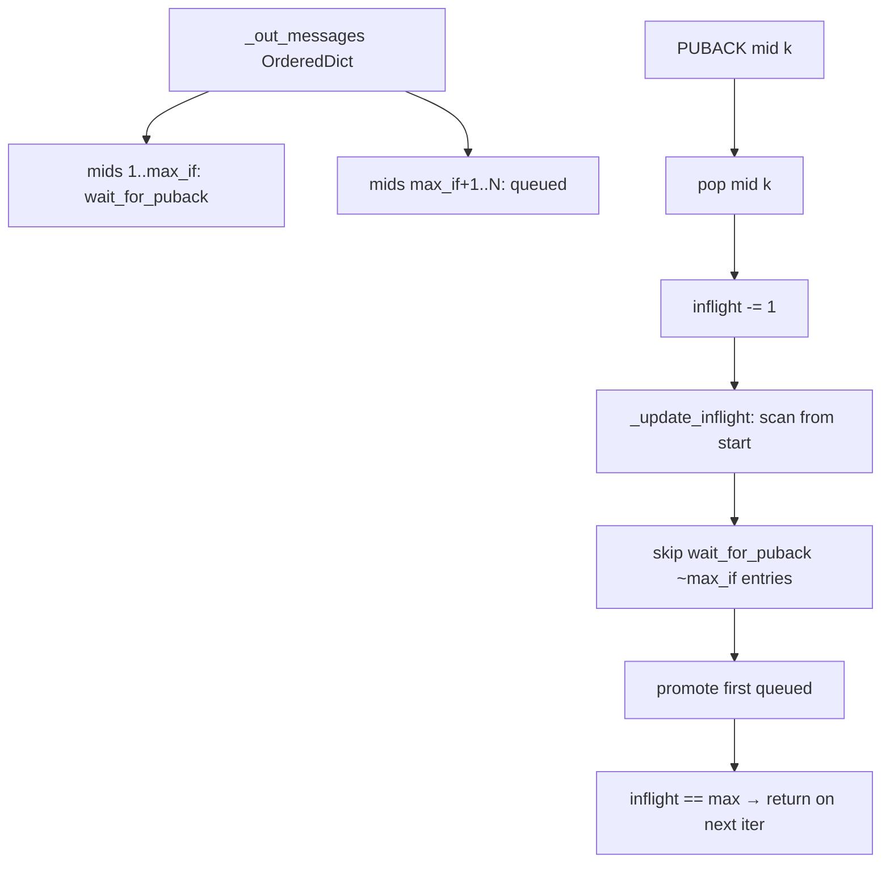

# 05 - Inflight Message State

## Problem

QoS 1 and QoS 2 publishing can spend CPU scanning message state. The relevant
state is `_out_messages`, `_in_messages`, `_inflight_messages`, and methods such
as `_update_inflight()`, `_messages_reconnect_reset_out()`,
`_messages_reconnect_reset_in()`, `_handle_pubackcomp()`, `_handle_pubrec()`,
and `_handle_pubrel()`.

Likely symptoms:

- CPU spikes when the outgoing queue is large and inflight slots free up.
- `_update_inflight()` scans `_out_messages.values()` to find queued messages.
- Reconnect reset walks all messages and can call send paths repeatedly.
- `OrderedDict` may preserve useful order but creates overhead compared with a
  queue of queued mids plus a mapping by mid.
- Topic bytes may be re-encoded on resend because `MQTTMessage.topic` exposes a
  decoded property.

Common workloads:

- Gateways publishing QoS 1 messages faster than the broker can ACK.
- High inflight limits with bursty network availability.
- Persistent sessions with many queued messages across reconnect.

## Theoretical Rationale

Scanning all outgoing messages to find the next queued message is O(n) per freed
inflight slot. Under saturation this can approach O(n*m), where `m` is the
number of acknowledgements or slots freed. A separate ready queue can make the
common operation O(1) or amortized O(1).

Modern CPUs handle linear scans well in C, but Python object iteration over
message objects and state checks is expensive. Reducing scan frequency should
matter more than micro-optimizing the state comparisons.

## Expected Gain

Priority: P1.

Conservative expected gain:

- 10 to 40 percent CPU reduction in saturated QoS 1 microbenchmarks with large
  queues.
- Lower p95 `publish()` and ACK handling latency when many messages are queued.
- Little or no improvement for QoS 0 or uncongested QoS 1 workloads.

## Before/After Measurements

Microbenchmarks:

- Populate `_out_messages` with 20, 100, 1000, and 10,000 QoS 1 messages.
- Simulate PUBACK handling and `_update_inflight()` with inflight limits 20,
  100, and 1000.
- Measure reconnect reset with mixed states: queued, wait_for_puback,
  wait_for_pubrec, wait_for_pubcomp.
- Measure memory overhead for additional queue/index structures.

Broker scenarios:

- Local QoS 1 publisher with broker ACK delay or limited receive rate.
- Publish burst larger than max inflight, then drain.
- Reconnect with queued QoS 1/QoS 2 messages.

Metrics:

- Time per ACK handled.
- Time to promote next queued message.
- CPU per 100,000 QoS 1 messages.
- Memory per queued message.
- End-to-end throughput under inflight saturation.

## Implementation Guidelines

Allowed implementation directions:

- Maintain a separate deque of queued outgoing mids for messages waiting for an
  inflight slot.
- Keep `_out_messages` as the authoritative mid-to-message mapping for
  compatibility and lookup.
- Ensure queue entries are removed or skipped safely when messages are removed.
- Store encoded topic bytes for outgoing messages to avoid re-encoding on
  resend, while preserving public `MQTTMessage.topic`.
- Consider small helper methods for state transitions to keep QoS correctness
  auditable.

Risks:

- Duplicate queue entries can cause duplicate sends.
- Removing messages from mapping and queue must remain consistent.
- QoS 2 state transitions are more fragile than QoS 1 and need focused tests.
- Memory overhead may outweigh gains for small queues.

## Acceptance Criteria

Functional criteria:

- Existing publish/QoS tests pass.
- Add tests for inflight saturation, queue promotion order, reconnect reset, and
  duplicate ACK/PUBREC/PUBREL handling.
- Preserve callback ordering and `MQTTMessageInfo` publication state.

Performance criteria:

- At least 20 percent faster ACK handling in a 10,000 queued-message saturated
  QoS 1 microbenchmark.
- No more than 5 percent memory increase per queued message unless throughput
  gain exceeds 25 percent.
- No regression above 2 percent for small queues of 20 messages.

Documentation criteria:

- Document the state invariants for mapping, ready queue, and inflight count.
- Record memory/performance tradeoff in the verdict.

## Verdict

GO with conditions.

Justification: this project has high upside for saturated QoS workloads but
adds state-management risk. It should proceed only after a benchmark proves
linear scans dominate and after state invariants are documented.

## Progress (2026-07-09)

Status: **Evaluated — NO GO ready-queue (ACK path)**; reconnect scan is a separate track.

### Measurement harness

[`benchmarks/inflight_saturation_eval.py`](../../benchmarks/inflight_saturation_eval.py) — brokerless, ~15 s full matrix + profile.

Environment: Python 3.12, `PYTHONPATH=src`, `FakeSendSocket` / `FakeRecvSocket`, no `on_publish` callback.

### Results (median, 3 repeats)

**ACK cycle** (PUBACK via `_packet_read` → `_do_on_publish` → `_update_inflight` → promote):

| Label | N | max_inflight | ops/s | µs/ACK |
| --- | ---: | ---: | ---: | ---: |
| unsaturated | 20 | 20 | 27 854 | 35.9 |
| saturated | 100 | 20 | 13 003 | 76.9 |
| saturated | 1 000 | 20 | 16 889 | 59.2 |
| saturated | 10 000 | 20 | 18 004 | 55.5 |
| sat_hi_if | 1 000 | 100 | 13 339 | 75.0 |
| sat_hi_if | 10 000 | 100 | 10 798 | 92.6 |

Scaling saturated `max_inflight=20`: ops(N=100) / ops(N=10 000) = **0.72** (no degradation; noise at low N).

**Single `_update_inflight()`** (one promotion, fresh queue): ~26 µs @ N=100, ~76 µs @ N=1 000, ~74 µs @ N=10 000 — flat beyond 1 000 (scan ≈ O(max_inflight), not O(N)).

**`_messages_reconnect_reset_out()`** (full dict scan): 84 → 7 → 3 resets/s for N=100 / 1 000 / 10 000 — **O(N) confirmed**.

**cProfile** ACK path (N=1 000, 600 ACKs): `_update_inflight` 46.5% cumulative (includes `_send_publish` 36.7%); parse/handle overhead dominates rest.

**tracemalloc**: ~5 B peak/ACK (N=1 000) — not allocation-bound.

### Verdict vs plan criteria

| Criterion | Result | Decision |
| --- | --- | --- |
| Scan dominates ACK path at N=1k/10k | `_update_inflight` visible in profile, but **per-ACK throughput flat vs N** | Scan is **O(max_inflight)** via early `return` once inflight full; queued entries sit after inflight in `OrderedDict` insertion order |
| Cost scales with N | **No** on ACK path (ratio ≈1.0 for 1k vs 10k) | Ready-queue **NO GO** for ACK/promote |
| Non-saturated cheap | Yes (~36 µs/ACK @ N=20) | Baseline OK |
| Encode topic secondary | `_send_publish` ~37% in profile; promotion cost is send-heavy | Topic cache **deferred** |

**Decision: NO GO** for mid deque / `_update_inflight` rewrite on the ACK→promote hot path.

**GO partial (future, out of scope here):** `_messages_reconnect_reset_out()` and CONNACK resend loops still do **O(N)** full scans — only worth touching if reconnect-heavy workloads are in scope (different invariant than ready-queue for queued mids).

### Invariant confirmed (why scan stays cheap)

Per ACK the scan visits **~max_inflight + 1** entries, not N.

Preserve upstream #884 PUBREL inflight contract if any future work touches QoS2 paths.
