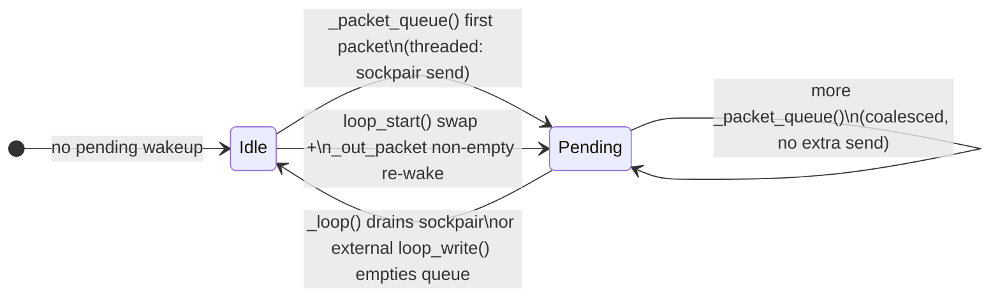

# 06 - Threading Wakeup and Event Loop

## Problem

The network loop must coordinate sockets, callbacks, and cross-thread publish
calls. The relevant code paths include `loop()`, `_loop()`, `loop_start()`,
`loop_stop()`, `_packet_queue()`, `_call_socket_register_write()`,
`_call_socket_unregister_write()`, and locks such as `_callback_mutex`,
`_in_callback_mutex`, `_out_message_mutex`, and `_msgtime_mutex`.

Likely symptoms:

- High system CPU under `loop_start()` with frequent cross-thread publishes.
- Excess socketpair wakeups when many packets are queued before one loop drain.
- Lock contention when publishing, receiving, and callbacks run concurrently.
- Repeated write registration changes for external event loops.
- Wakeup overhead hiding actual packet processing cost in profiles.

Common workloads:

- Application threads publishing telemetry while Paho runs its network thread.
- Async applications using external event loop integration.
- Callbacks that publish follow-up messages.

## Theoretical Rationale

Cross-thread wakeups require kernel involvement and often trigger context
switches. A single wakeup can drain many queued packets, so per-packet wakeups
are wasteful during bursts. Lock acquisition is usually cheap when uncontended
but can become expensive when callbacks, publishing, and loop operations compete
under the GIL.

The design should distinguish three cases:

- Network thread already awake and draining.
- Network thread blocked in `select()`.
- External event loop owns readiness notifications.

Each case has different optimal wakeup behavior.

## Expected Gain

Priority: P1.

Conservative expected gain:

- 10 to 30 percent lower system CPU for threaded publish bursts if wakeups are
  currently per-packet.
- 5 to 15 percent throughput improvement for producer workloads.
- Lower p95 publish-to-send latency during bursts if queue drain is more
  efficient.

The gain is likely small for single-threaded manual `loop()` users.

## Before/After Measurements

Microbenchmarks:

- Count socketpair writes for 1, 10, 100, and 10,000 `_packet_queue()` calls.
- Measure time for publish bursts from one, two, and four producer threads.
- Measure lock wait time using lightweight instrumentation around key locks.
- Measure external event loop registration callback counts.

Broker scenarios:

- `loop_start()` QoS 0 publish burst from a worker thread.
- Callback publishes a response message while receiving.
- External selector integration using `loop_read()`, `loop_write()`, and
  `loop_misc()`.

Metrics:

- Socketpair writes and reads.
- Context-switch proxy metrics where available.
- User/system CPU split.
- Messages per second.
- p95 publish-to-send latency.
- Register/unregister callback counts.

## Implementation Guidelines

Allowed implementation directions:

- Add a private wakeup state flag protected by existing queue semantics or a
  minimal lock.
- Clear the wakeup flag only when the socketpair has been drained and the output
  queue has been observed.
- Avoid wakeup coalescing for external event loop mode unless registration
  semantics are preserved.
- Reduce lock scope around timestamp updates and callback lookup if profiling
  proves contention.
- Keep `_in_callback_mutex` behavior that prevents recursive network writes from
  unsafe contexts.

Risks:

- Lost wakeups can stall outgoing packets until the next keepalive or timeout.
- Over-coalescing can improve throughput while hurting low-volume latency.
- External event loop integration is sensitive to write registration semantics.
- Lock changes can introduce rare races.

## Acceptance Criteria

Functional criteria:

- Existing asyncio/select examples and tests continue to work.
- Add tests for burst publish waking a sleeping loop exactly enough to drain.
- Add tests for external event loop write registration behavior.
- Add tests for publish from callback.

Performance criteria:

- At least 50 percent fewer socketpair writes during a 10,000-message burst.
- At least 10 percent lower system CPU in threaded burst benchmark.
- No p95 latency regression above 5 percent for single-message publish while
  the loop is sleeping.

Documentation criteria:

- Document the wakeup state machine.
- Record which mode is optimized: threaded loop, manual loop, or external loop.

## Verdict

GO with conditions.

Justification: wakeup coalescing can deliver meaningful CPU savings in real
producer workloads, but lost-wakeup risk is serious. Implement only with focused
threaded and external-loop tests.

## Progress (2026-07-09)

Status: **Done (this PR)** — core coalesce via project 02; residual tests + state machine doc closed here. **07 WebSocket out of scope** for this PR.

### Implemented (in write-path commits)

- `_sockpair_wakeup_pending` + `_sockpair_wakeup_mutex`.
- Coalesced `_packet_queue()` wakeup send.
- Drain clears pending under the same mutex in `_loop()`.
- `loop_start()` sockpair swap under mutex + re-wake if queue non-empty.
- Tests: coalesce, concurrent `loop_start` vs queue, external-loop register/unregister, publish-from-callback deferral.

### Wakeup state machine

Three integration modes share one queue but differ in how the network side is notified:

| Mode | `_thread` | `on_socket_register_write` | Wakeup path | Coalesce |
| --- | --- | --- | --- | --- |
| Manual `loop()` | `None` | `None` | `_packet_queue()` → `loop_write()` if not in callback | N/A (same thread) |
| `loop_start()` | set | any | sockpair byte; drain in `_loop()` | **Yes** (`_sockpair_wakeup_pending`) |
| External / asyncio | `None` | set | `_call_socket_register_write()` once | Register coalesced via `_registered_write` |

**In-callback publish:** `_in_callback_mutex` is held during `on_message` / `on_publish`. `_packet_queue()` must not call `loop_write()` while the mutex is held (`acquire(False)` guard). Follow-up packets stay queued until the callback returns and the loop drains them — covered by `test_publish_from_on_message_defers_loop_write`.

**External loop:** `_packet_queue()` registers write interest; `loop_write()` unregisters when `want_write()` is false — `test_external_loop_unregister_write_after_drain`.

### Acceptance (re-measured 2026-07-09)

| Criterion | Result |
| --- | --- |
| ≥ 50% fewer sockpair writes on 10k burst | **PASS** — 10 000 queues → **1** send (`sockpair_wakeup_coalesce_10000`) |
| Functional: coalesce / partial write / external loop / callback publish | **PASS** — 13 tests in `test_client_write_performance.py` |
| Threaded publish drain | **PASS** — `publish_threaded_qos0_v3_small` ~77k msgs/s median (3k/run, brokerless) |
| Formal wakeup doc | **PASS** — this section |
| Broker system-CPU profile | **Deferred** — brokerless harness sufficient for this PR |

### Verdict

**GO — closed.** Wakeup coalescing delivers the expected syscall reduction; mutex pairing prevents missed wakeups on `loop_start()` swap. No further 06 code changes required before merge. Lock-scope reductions and broker-side CPU profiles remain optional follow-ups outside this PR.
